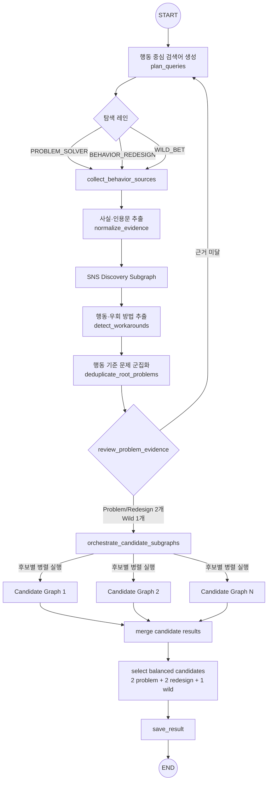
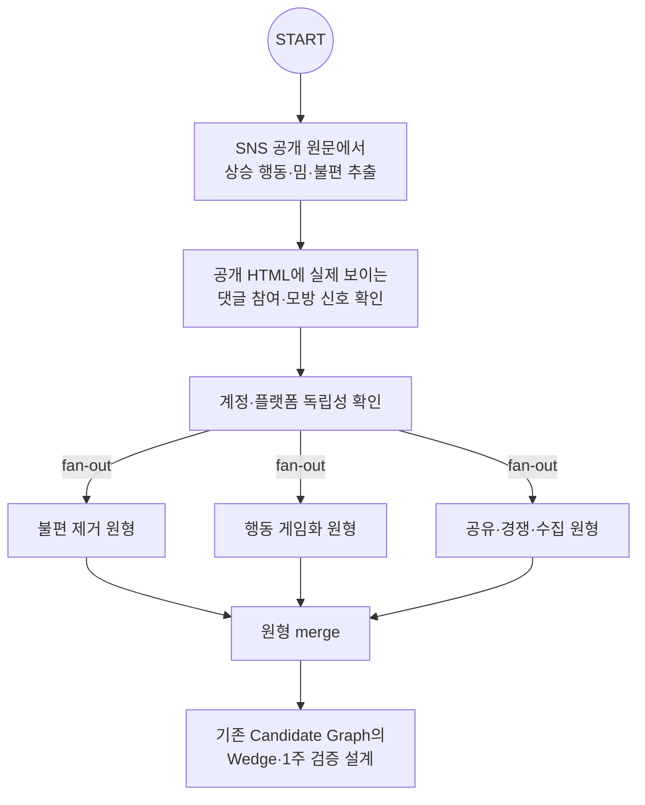
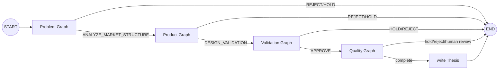
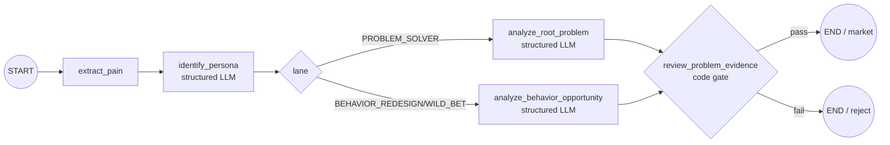
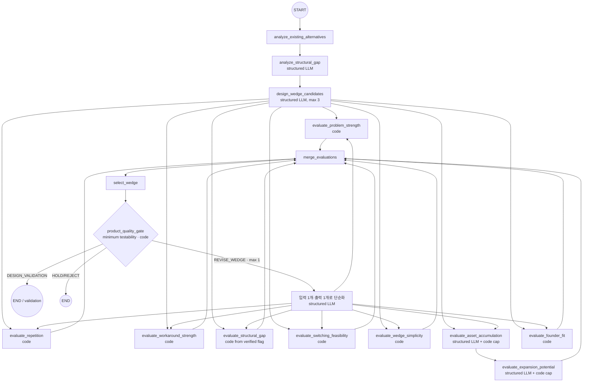
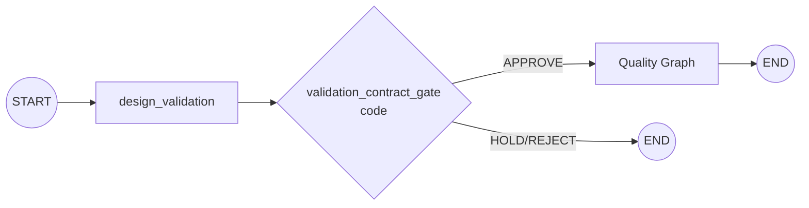
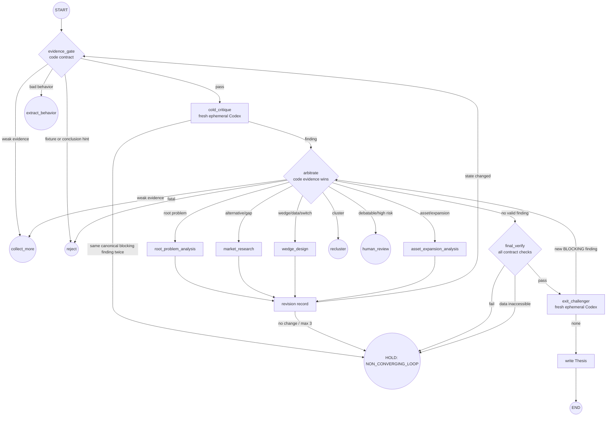

# Graph Design

실제 builder가 등록한 conditional route registry, fan-out/fan-in, back-edge와 모든 종료 경로를 한 번에 보려면 [Runtime Graph](runtime-graph.md)를 사용한다.

실제 CLI/API 실행은 `PortfolioDiscoveryGraph` facade가 컴파일된 최상위 LangGraph를 호출한다. 각 함수는 독립 호출 가능한 단일 책임 노드이고, 후보별 Problem/Product/Validation/Quality 그래프는 독립 테스트 가능한 서브그래프다.

## 전체 오케스트레이션

## SNS Discovery Graph

SNS 검색은 앱 아이디어 추천을 찾지 않는다. 갑자기 늘어난 행동, 챌린지·놀이,
여러 앱을 조합한 생활 해킹, 반복 귀찮음, 제작 요청, 댓글의 추가 요구,
캡처 자랑, 제품 없이 존재하는 경쟁·수집을 찾는다. 신호는 로그인 없이 GET한
`ORIGINAL_VERIFIED` 원문만 인정한다. 동일 계정의 여러 글은 독립 확인으로
증가하지 않고, 플랫폼 계정을 URL 또는 공개 메타데이터로 확인할 수 없으면
`unknown`으로 남긴다.

세 원형 노드는 실제 LangGraph fan-out/fan-in edge다. 이 단계에서는 해결책을
입력으로 받지 않으며, 원형 결과는 이후 행동 군집과 근거 Gate를 거쳐 Product와
Validation 그래프로 전달된다. 따라서 흐름은 `SNS 원문 → 행동 → 군집 → 문제/기회
→ Wedge → 1주 검증` 순서다.

## 후보별 오케스트레이터

## Problem Graph

`extract_pain`은 문제 해결형에서만 손실 근거로 사용한다. 행동 재설계형과 Wild Bet은 고통이나 우회 행동을 요구하지 않고, 관찰된 반복 행동에서 경쟁·수집·정체성·공유·진행감으로 바꿀 수 있는 의미 축만 분석한다. Wedge는 이후 별도 노드가 생성한다.

## Product Graph

평가 fan-out은 실제 LangGraph 병렬 edge다. 각 평가 노드는 자신의 필드만 기록하며 `merge_evaluations`에서 합친다. 축적 자산과 확장 경로도 서로 다른 노드다. 원문이 자산 통제와 재사용을 뒷받침하지 않으면 코드가 두 점수를 0/unknown으로 제한한다.

첫 Wedge가 복잡하거나 데이터 접근 불가로 표시됐더라도, 근거 Gate를 통과했고
사용자가 입력을 직접 제공하며 수동 대행 실험이 가능하면 즉시 HOLD하지 않는다.
`simplify_wedge_to_one_input_one_output`을 최대 한 번 호출해 외부 데이터·공급자·
네트워크 없이 `입력 1개 → 즉시 결과 1개`로 재설계하고 모든 평가 fan-out과 Product
Gate를 다시 실행한다. 실제 외부 데이터 차단이 남거나 두 번째 Gate도 실패하면 HOLD한다.

## 확인편향 방지 입력 경계

`discover-from-urls`의 URL 항목은 `url`, `title`, `source_type`, `discovered_via_query`, `published_at`만 허용한다. `persona`, `root_problem`, `wedge`, `asset`, `expansion`, 최종 평가는 Pydantic `extra="forbid"`로 입력 단계에서 거부한다. 따라서 데이터 흐름은 반드시 `원문 → 행동 → 문제 → 해결책`이고, 미리 만든 아이디어에 맞는 원문을 사후 정당화하는 흐름을 허용하지 않는다.

## Validation Graph

## Quality Gate → Critique → Arbitrate → Revise → Verify

`DiscoveryContract`는 시작 시 레인별 독립 근거 수, 원문 GET, 문제 해결형의 우회 행동, 행동 재설계형의 즉시 결과·반복 동기·10초 전달성, Wild Bet의 14일·저비용 한도, fixture/결론 힌트 금지와 반복 상한을 고정한다. `cold_critique`와 `exit_challenger`는 각각 새 read-only Codex 프로세스로 실행한다.

행동 재설계형 Validation Contract는 단순 첫 반응을 통과시키지 않는다. 고정된
기준은 `10명 cohort`, `7일 관찰`, `4명 이상이 5일 이상 사용`, `3명 이상 다음 주
계속 사용 요청`, `2명 이상 자발적 결과 공유`, `공유 유입 발생`, `다음 결과에 대한
호기심이 재사용 이유인지 확인`이다. 이 구조화 필드가 빠지면 Validation Gate와
Final Verify가 모두 HOLD한다.

`REPORT_COMPLETE`는 그래프 실행/보고서 작성의 성공 상태다. 아이디어 판정은 `VALIDATE_PROBLEM`, `VALIDATE_DELIGHT`, `WILD_BET`, `HOLD`, `REJECT`다. 앞의 세 상태는 성공 판정이 아니라 서로 다른 실험 대상으로 승인했다는 뜻이다. 행동 재설계형에서 고통 미제거, 자산·확장 미검증은 자동 차단 사유가 아니다.

수정은 category별 정확한 노드로 돌아간 후 항상 `evidence_gate`부터 재검증한다. critique/revision은 각각 최대 3회이고, 동일 BLOCKING category가 두 번 나오거나 fingerprint가 변하지 않으면 HOLD한다. Thesis는 `final_verify`와 `exit_challenger`를 모두 통과한 후보에만 작성한다.

## LLM과 코드의 결정 경계

| 판단 | 담당 |
|---|---|
| 원문 접근 여부, 독립 URL/작성자, A-C 근거 수 | 코드 |
| 중복 유사도, 필수 필드, 점수 합산, 후보 상한 | 코드 |
| 재시도 횟수, 데이터 접근 불가, 첫 사용자 가치 필수 조건 | 코드 |
| 표면 불편 아래의 근본 문제 | 구조화된 LLM |
| 대안이 남기는 구조적 공백의 의미 | 구조화된 LLM |
| 본질적으로 다른 진입 웨지 | 구조화된 LLM |
| 자산과 확장 사이의 의미적 인과관계 제안 | 구조화된 LLM, 코드가 근거 상태 제한 |
| 가장 강한 반론과 제안 경로 | 구조화된 LLM, 코드가 최종 override |

모든 LLM 출력은 Pydantic 스키마로 검증한다. `LLM_PROVIDER=codex`에서는 로그인된 Codex CLI의 GPT를 사용한다. deterministic fake는 명시적인 테스트 실행에만 사용하며 Codex 오류 시 fallback으로 사용하지 않는다.

## 패턴 출처와 검증 한계

Ranteck/graph-engineer에서 차용한 것은 일반적인 `QUALITY GATE → CRITIQUE → ARBITRATE → REVISE → VERIFY` 그래프 패턴뿐이다. 저장소의 Claude Code skill, 코드 개발용 역할, `PROJECT_CONTEXT.md`, 소스코드나 고유 문구는 설치·복사하지 않았다. 따라서 별도 저작권 코드가 포함되지 않는다.

아이디어 생성·Cold Critique·Exit Challenger가 모두 같은 Codex 모델을 사용하므로 독립적인 교차 모델 검증은 아니다. fresh/ephemeral 실행은 이전 판단에 끌리는 현상을 줄일 뿐 같은 모델의 공통 맹점을 제거하지 못한다. 책임 경계는 **Codex: 비판 제안 → 코드 Gate: 확인 가능한 사실 판정 → 사람: 논쟁적·고위험 판단 승인**이다.

## 종료 및 실패 처리

- 독립적인 `ORIGINAL_VERIFIED` A-C 근거가 두 건 미만이면 후보 그래프를 호출하지 않는다.
- snippet-only 자료는 승인 근거로 승격하지 않는다.
- Quality critique와 revision은 각각 최대 3회이며, 동일 canonical blocking finding 2회 또는 무변경 반복은 HOLD한다.
- 후보 그래프는 서로 병렬 실행되고 실패는 최상위 실행 실패로 기록된다.
- 최종 후보는 근본 문제뿐 아니라 행동·해결 archetype 유사도를 다시 검사하며 최대 5개이고 부족분을 채우지 않는다.
